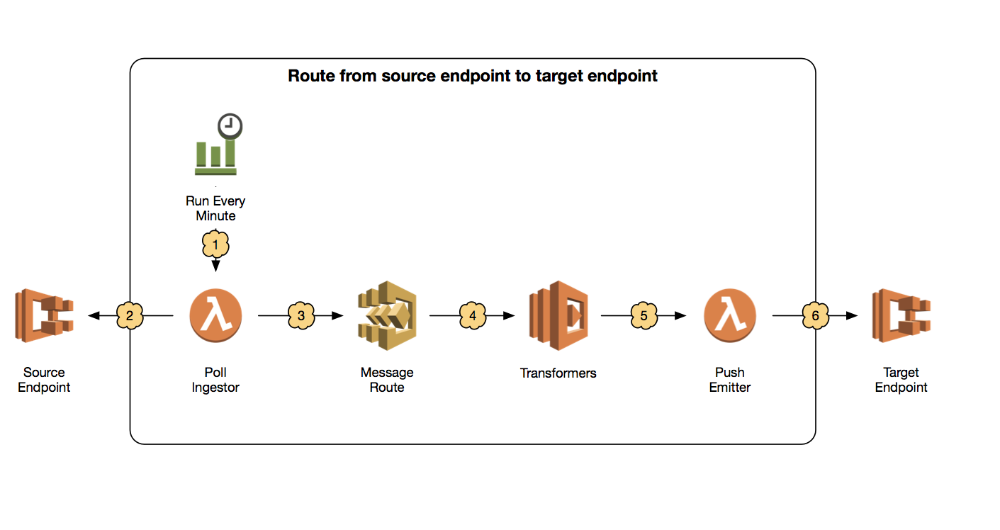
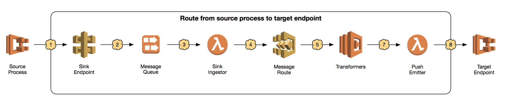
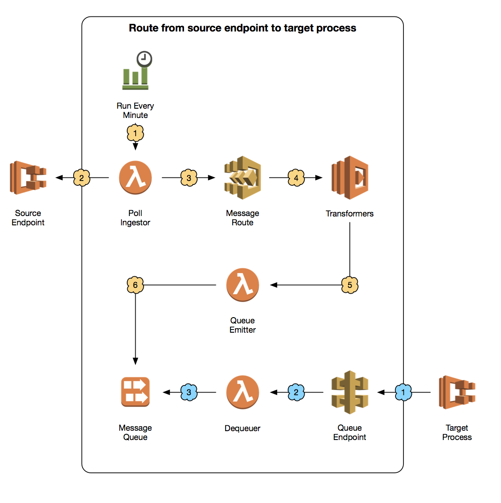
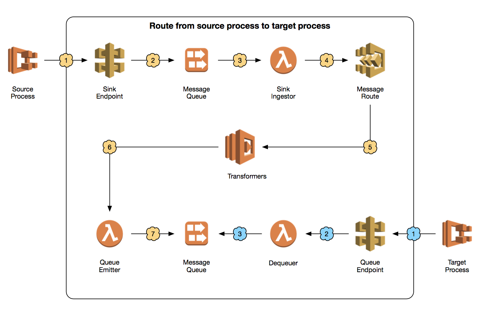

# Serverless Message Routing Demo
This project demonstrates a message routing system over HTTP leveraging Amazon Web Services serverless offerings, such as API Gateway, Kinesis, and Lambda. There are four message routes that are demonstrated, each built of several components. Both push and pull models are demonstrated at either end of the route.

The project also contains simulators of message sources that emit messages and targets that consume them. As such, the functionality of any route can be demonstrated. The source and target components are built as Docker images, which can be run on Amazon EC2 Container Service.

Please note: These routes and their various components are for demonstration purposes only. They are not production-ready. Much additional thinking would be needed around security, robustness, and other areas such as error handling and throughput. The routes are designed to demonstrate basic concepts.

## Sources and Targets
Sources and targets come in two flavors: endpoints and processes. An endpoint emits or receives a set of messages when
an HTTP request is made of it. A process emits or polls for messages at set intervals. As such, there are four source
and target components, as follows:
  1. **Source Endpoint:** A source endpoint component starts a lightweight web server that responds to HTTP requests
  with a set of messages.
  2. **Source Process:** A source process component makes POST requests of a given URL at set intervals.
  3. **Target Endpoint:** A target endpoint component starts a lightweight web server that accepts HTTP requests that
  are POSTed to it with a set of messages.
  4. **Target Process:** A target process component makes requests of a given URL at set intervals, providing a
  timestamp as a query parameter, in essence, asking for all messages that have come across since that timestamp.

## Routes
The project demonstrates four HTTP-based routes, as follows:
  1. Source Endpoint to Target Endpoint
  2. Source Process to Target Endpoint
  3. Source Endpoint to Target Process
  4. Source Process to Target Process

Each is detailed below.

### Source Endpoint to Target Endpoint


This route uses CloudWatch Events to trigger an igester Lambda periodically. The igester Lambda polls the Source Endpoint when triggered, sending each message to a state machine defined in AWS Step Functions. Step Functions pushes the message through a set of transformers defined in Lambda, handling failures and retry logic. (In the example routes, only a single demonstrative transformer Lambda is defined.) The final step of the Step Function is an emitter Lambda, which pushes the message to the Target Endpoint by providing it on an HTTP POST request.

### Source Process to Target Endpoint


This route deploys an endpoint in API Gateway that a Source Process can hit with a POST request containing new messages. From the perspective of the source process, the endpoint acts as a sink, receiving all new messages. The endpoint also proxies an Amazon Kinesis tream, which buffers and queues messages for processing. The Kinesis Stream is configured as a trigger for an ingestor Lambda, which takes messages from the Kinesis Stream and sneds it to a state machine defined in AWS Step Functions. Step Functions pushes each message through a set of transformers defined in Lambda, handling failures and retry logic. The final step of the Step Function is an emitter Lambda which pushes the message to the Target Endpoint by providing it on an HTTP POST request.

### Source Endpoint to Target Process


This route uses CloudWatch Events to trigger an ingestor Lamba periodically. The ingestor Lambda polls the Source Endpoint when triggered, sending each message to a state machine defined in AWS Step Functions. Step Functions pushes the message through a set of transformers defined in Lambnda, handling failures and retry logic. The final step of the Step Function is an emitter Lambda which pushes the message to an Amazon Kinesis Stream, which acts as a queue.

Asynchronously, a Target Process can make periodic GET requests to an endpoint defined in API Gateway, asking for new messages. The endpoint proxies a dequeueing Lambda, which returns messages from the Kinesis Stream. The Target Process provides a timestamp as part of its request, and receives all messages that have accumulated since that timestamp.

### Source Process to Target Process


This route deploys an endpoint in API Gateway that a Source Process can hit with a POST request containing new messages. From the perspective of the source process, the endpoint acts as a sink, receiving all new messages. The endpoint also proxies an Amazon Kinesis tream, which buffers and queues messages for processing. The Kinesis Stream is configured as a trigger for an ingestor Lambda, which takes messages from the Kinesis Stream and sneds it to a state machine defined in AWS Step Functions. Step Functions pushes each message through a set of transformers defined in Lambda, handling failures and retry logic. The final step of the Step Function is an emitter Lambda which pushes the message to an Amazon Kinesis Stream, which acts as a queue.

Asynchronously, a Target Process can make periodic GET requests to an endpoint defined in API Gateway, asking for new messages. The endpoint proxies a dequeueing Lambda, which returns messages from the Kinesis Stream. The Target Process provides a timestamp as part of its request, and receives all messages that have accumulated since that timestamp.

## Packages
All packages require Node.js 6.x or above. Lambdas are built on the [Lambda Base](https://github.com/morrissinger/lambda-base). Sources and Targets are containerized with Docker and can be deployed on Amazon EC2 Container Service.

### ingestors
ingestors provide the ability to pull messages from a source into a message route. Each ingestor can be built as a Lambda. Additionally, each ingestor has a pre-built Lambda Zip file available in a publicly accessible S3 bucket.

#### Poll ingestor
Lambda Zip: [https://s3.amazonaws.com/f12f301f-messaging-demo/lambdas/poll-ingestor-lambda.zip](https://s3.amazonaws.com/f12f301f-messaging-demo/lambdas/dequeuer-lambda.zip)

The Poll ingestor responds to a trigger by requesting new messages from a source via an HTTP request and passing each new message to a state machine execution in AWS Step Functions.

The following environment variables must be supplied to the Lambda:
  * `ENDPOINT`: An endpoint to poll for new messages.
  * `METHOD`: An HTTP method with which to make requests of the endpoint provided in the `ENDPOINT` environment variable.
  * `STATE_MACHINE_ARN`: The ARN of an AWS Step Functions state machine to execute with each new message.

#### Sink ingestor
Lambda Zip: [https://s3.amazonaws.com/f12f301f-messaging-demo/lambdas/sink-ingestor-lambda.zip](https://s3.amazonaws.com/f12f301f-messaging-demo/lambdas/dequeuer-lambda.zip)

A Sink ingestor retrieves a batch of messages pushed to the route by a source and passes each new message to a state machine in AWS Step Functions.

The following environment variables must be supplied to the Lambda:
  * `STATE_MACHINE_ARN`: The ARN of an AWS Step Functions state machine to execute with each new message.

### Transformers
Transformers provide the ability to change the shape of a message and its data in-flight. There is only one transformer provided in this demonstration. It can be built as a Lambda. Additionally, the transformer has a pre-built Lambda Zip file available in a publicly accessible S3 bucket.

#### Transformer
Lambda Zip: [https://s3.amazonaws.com/f12f301f-messaging-demo/lambdas/transformer-lambda.zip](https://s3.amazonaws.com/f12f301f-messaging-demo/lambdas/dequeuer-lambda.zip)

This Transformer simply provides an additional attribute to each JSON message payload, the looks like the following:

```json
{
  "additionalValue": true
}
```

This is sufficient for demonstrating transformer functionality.

There are no environment variables to be configured.

### Emitters
Emitters provide the ability to take a message that has completed a message route and provide it to a target. Each emitter can be built as a Lambda. Additionally, each emitter has a pre-built Lambda Zip file available in a publicly accessible S3 bucket.

#### Queue Emitter / Dequeuer
Queue Emitter Lambda Zip: [https://s3.amazonaws.com/f12f301f-messaging-demo/lambdas/dequeuer-lambda.zip](https://s3.amazonaws.com/f12f301f-messaging-demo/lambdas/queue-emitter-lambda.zip)
Dequeuer: [https://s3.amazonaws.com/f12f301f-messaging-demo/lambdas/dequeuer-lambda.zip](https://s3.amazonaws.com/f12f301f-messaging-demo/lambdas/dequeuer-lambda.zip)

The Queue Emitter is the final step in the state machine associated with a message route that must interface with a target that polls for new messages. It pushes new messages into a Kinesis Stream where they wait for dequeuing on requests from the target.

The Dequeuer sits on the other side of the Kinesis Stream. It is an API Gateway Lambda Proxy that responds to HTTP requests from a target by retrieving new messages that have accumulated since the time provided in a provided timestamp.

The following environment variables must be supplied to the Queue Emitter and Dequeuer Lambdas:
  * `KINESIS_STREAM_ID`: The name of a Kinesis Stream into which to push messages and from which to retrieve messages.
  * `KINESIS_SHARD_ID`: The ID of a Kinesis Stream Shard into which to push messages and from which to retrieve messages.

#### Push Emitter
Lambda Zip: [https://s3.amazonaws.com/f12f301f-messaging-demo/lambdas/push-emitter-lambda.zip](https://s3.amazonaws.com/f12f301f-messaging-demo/lambdas/queue-emitter-lambda.zip)

The Push Emitter is the final step in the state machine associated with a message route that must interface with a target that receives new messages through HTTP requests ot its endpoint.

The following environment variables must be supplied to the Lambda:
  * `ENDPOINT`: The URL of the endpoint on the Target that receives messages.

### Simulators
Simulators provide mocked sources for new messages and targets for message routing, allowing the functionality of routes to be demonstrated. A source can emit a message and the message can be observed making its way across the various components in a route via the specific services in the AWS Console and CloudWatch Logs.

Each simulator is provided with a `Dockerfile` so it can be packaged as a Docker image. Additionally, each simulator has a pre-built Docker image, which can be used out-of-the-box.

#### Source Endpoint
Docker Image: `196431283258.dkr.ecr.us-east-1.amazonaws.com/messaging-demo/source-endpoint`

The Source Endpoint spins up a light-weight web server with an endpoint that can generate mock messages when requested. Messages are provided in a JSON array consisting of objects that match the following example:

```json
{
  "id": 0,
  "timestamp": 0123456789,
  "message": "Equals sha1(timestamp)."
}
```

The `id` attribute progresses sequentially with every message in every request. As such, it is possible to identify whether every message that came from the source ended up at the target.

The following environment variables must be supplied to the container:
  * `BATCH_SIZE`: The batch size of messages to emit when requests are made of the endpoint.
  * `LOG_LEVEL`: One of [`error`, `warn`, `info`, `verbose`, `debug`, `silly`]. Recommended: `verbose`.

#### Source Process
Docker Image: `196431283258.dkr.ecr.us-east-1.amazonaws.com/messaging-demo/source-process`

The Source Process continually makes HTTP requests of an endpoint specified as an environment variable. Each request contains a JSON array consisting of objects that match the example message provided in the Source Endpoint, above.

The following environment variables must be supplied to the container:
  * `BATCH_SIZE`: The batch size of messages to emit when requests are made of the endpoint.
  * `ENDPOINT`: The URL of an ingestor or emitter API to which to point the component.
  * `FREQUENCY`: The number of milliseconds between requests.
  * `LOG_LEVEL`: One of [`error`, `warn`, `info`, `verbose`, `debug`, `silly`]. Recommended: `verbose`.

#### Target Endpoint
Docker Image: `196431283258.dkr.ecr.us-east-1.amazonaws.com/messaging-demo/target-endpoint`

The Target Endpoint spins up a light-weight web server with an endpoint that logs messages received on the POST body to the console (and to CloudWatch Logs).

The following environment variables must be supplied to the container:
  * `LOG_LEVEL`: One of [`error`, `warn`, `info`, `verbose`, `debug`, `silly`]. Recommended: `verbose`.

#### Target Process
Docker Image: `196431283258.dkr.ecr.us-east-1.amazonaws.com/messaging-demo/target-process`

The Target Process continually makes HTTP requests of an endpoint specified as an environment variable. Each requet contains a `timestamp` query parameter. The expectation is that the endpoint will respond with all messages that have accumulated since the time provided in the `timestamp`.

The following environment variables must be supplied to the container:
  * `ENDPOINT`: The URL of an emitter API to which to point the component.
  * `FREQUENCY`:The number of milliseconds between requests.
  * `LOG_LEVEL`: One of [`error`, `warn`, `info`, `verbose`, `debug`, `silly`]. Recommended: `verbose`.
  * `METHOD`: The method for making requests against an emitter API.

## Templates

Template Name | Template URL
--------------|------------
Fargate Cluster|https://s3.amazonaws.com/f12f301f-messaging-demo/templates/fargate-cluster.yaml
Source Endpoint|https://s3.amazonaws.com/f12f301f-messaging-demo/templates/source-endpoint.yaml
Source Process|https://s3.amazonaws.com/f12f301f-messaging-demo/templates/source-process.yaml
Target Endpoint|https://s3.amazonaws.com/f12f301f-messaging-demo/templates/target-endpoint.yaml
Target Process|https://s3.amazonaws.com/f12f301f-messaging-demo/templates/target-process.yaml
Source Endpoint to Target Endpoint Route|https://s3.amazonaws.com/f12f301f-messaging-demo/templates/source-endpoint--target-endpoint.yaml
Source Endpoint to Target Process Route|https://s3.amazonaws.com/f12f301f-messaging-demo/templates/source-endpoint0target-process.yaml
Source Process to Target Endpoint Route|https://s3.amazonaws.com/f12f301f-messaging-demo/templates/source-process--target-endpoint.yaml
Source Process to Target Process Route|https://s3.amazonaws.com/f12f301f-messaging-demo/templates/source-process-target-process.yaml
## Deploying

Simulators should be deployed on an EC2 Container Service cluster. Deploying on a Cluster using Fargate is the easiest and most cost effective way of doing so. At the time of this writing, Fargate is only available in `us-east-1`, so links only to deploying in this region are provided here.

[DEPLOY TO AWS](https://console.aws.amazon.com/cloudformation/home?region=us-east-1#/stacks/new?stackName=messaging-demo-ecs-cluster&templateURL=https://s3.amazonaws.com/f12f301f-messaging-demo/templates/fargate-cluster.yaml)

You can tail the logs for the source and target to see successful evidence of message routing. Message contents are written to the logs on both sides. Additionally, you can view the logs for each of the component Lambda functions, as well as request the status of any of the Step Functions Executions using the AWS CLI or the Management Console.

N.B.: Endpoint simulators must be deployed before the routes vthat use them are deployed. This is because routes that interface with endpoint simulators must be configured with their respective endpoints at deploy-time. Process simulators must be deployed after the routes that use them are deployed. This is because they must be configured with their respective endpoints at deploy-time. These are limitations of this demo. These limitations are inherent to the demo and are not inherent to serverless message routing systems.

# Deploying a Source Endpoint-to-Target Endpoint Route with Simulators
Deploy the route using the following steps:

  1. Deploy a Source Endpoint: [DEPLOY TO AWS](https://console.aws.amazon.com/cloudformation/home?region=us-east-1#/stacks/new?stackName=messaging-demo-ecs-cluster&templateURL=https://s3.amazonaws.com/f12f301f-messaging-demo/templates/source-endpoint.yaml)
  2. Deploy a Target Endpoint: [DEPLOY TO AWS](https://console.aws.amazon.com/cloudformation/home?region=us-east-1#/stacks/new?stackName=messaging-demo-ecs-cluster&templateURL=https://s3.amazonaws.com/f12f301f-messaging-demo/templates/target-endpoint.yaml)
  3. Deploy a route between the source and the target: [DEPLOY TO AWS](https://console.aws.amazon.com/cloudformation/home?region=us-east-1#/stacks/new?stackName=messaging-demo-ecs-cluster&templateURL=https://s3.amazonaws.com/f12f301f-messaging-demo/templates/source-endpoint--target-endpoint.yaml)

# Deploying a Source-Endpoint-to-Target-Process Route with Simulators

  1. Deploy a Source Endpoint: [DEPLOY TO AWS](https://console.aws.amazon.com/cloudformation/home?region=us-east-1#/stacks/new?stackName=messaging-demo-ecs-cluster&templateURL=https://s3.amazonaws.com/f12f301f-messaging-demo/templates/source-endpoint.yaml)
  2. Deploy a route between the source and the target: [DEPLOY TO AWS](https://console.aws.amazon.com/cloudformation/home?region=us-east-1#/stacks/new?stackName=messaging-demo-ecs-cluster&templateURL=https://s3.amazonaws.com/f12f301f-messaging-demo/templates/source-endpoint--target-process.yaml)
  3. Deploy a Target Process: [DEPLOY TO AWS](https://console.aws.amazon.com/cloudformation/home?region=us-east-1#/stacks/new?stackName=messaging-demo-ecs-cluster&templateURL=https://s3.amazonaws.com/f12f301f-messaging-demo/templates/target-process.yaml)

# Deploying a Source Process-to-Target-Endpoint Route with Simulators

  1. Deploy a Target Endpoint: [DEPLOY TO AWS](https://console.aws.amazon.com/cloudformation/home?region=us-east-1#/stacks/new?stackName=messaging-demo-ecs-cluster&templateURL=https://s3.amazonaws.com/f12f301f-messaging-demo/templates/target-endpoint.yaml)
  2. Deploy a route between the source and the target: [DEPLOY TO AWS](https://console.aws.amazon.com/cloudformation/home?region=us-east-1#/stacks/new?stackName=messaging-demo-ecs-cluster&templateURL=https://s3.amazonaws.com/f12f301f-messaging-demo/templates/source-process--target-endpoint.yaml)
  3. Deploy a Source Process: [DEPLOY TO AWS](https://console.aws.amazon.com/cloudformation/home?region=us-east-1#/stacks/new?stackName=messaging-demo-ecs-cluster&templateURL=https://s3.amazonaws.com/f12f301f-messaging-demo/templates/source-process.yaml)

# Deploying a Source Process-to-Target-Process Route with Simulators

  1. Deploy a route between the source and the target: [DEPLOY TO AWS](https://console.aws.amazon.com/cloudformation/home?region=us-east-1#/stacks/new?stackName=messaging-demo-ecs-cluster&templateURL=https://s3.amazonaws.com/f12f301f-messaging-demo/templates/source-process--target-process.yaml)
  2. Deploy a Source Process: [DEPLOY TO AWS](https://console.aws.amazon.com/cloudformation/home?region=us-east-1#/stacks/new?stackName=messaging-demo-ecs-cluster&templateURL=https://s3.amazonaws.com/f12f301f-messaging-demo/templates/source-process.yaml)
  3. Deploy a Target Endpoint: [DEPLOY TO AWS](https://console.aws.amazon.com/cloudformation/home?region=us-east-1#/stacks/new?stackName=messaging-demo-ecs-cluster&templateURL=https://s3.amazonaws.com/f12f301f-messaging-demo/templates/target-process.yaml)

